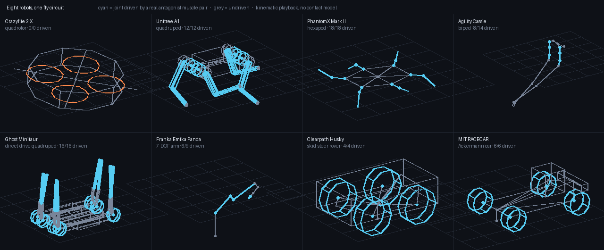

# Neural Transistor

Compile circuits from a fly connectome into freestanding C for microcontrollers.



<sub>Eight published URDFs, imported unmodified, bound to one compiled `legs` circuit.
**Cyan** joints are driven by a real antagonist muscle pair; **grey** joints are not
driven. This is kinematic playback of joint commands — what `robot_state_publisher`
shows in RViz, not a dynamics simulation. The sign and relative magnitude of every
command come from the connectome; the step rhythm does not, and
[Robots](#robots) says exactly which parts are which. Regenerate with
`python demos/formfactors.py`.</sub>

`neuraltransistor` reads the published *Drosophila* male-CNS connectome, extracts a named
circuit as a sparse signed graph, prunes it against a measured noise model, quantizes it
to int8, and emits C99 with no `malloc`, no libc beyond `memset`, and no floating point
in the tick loop. The emitted code is bit-identical to the reference implementation and
builds clean under `-Wall -Wextra -Werror`.

There is no training data and no training step. Structure and sign come from the
measurement. Only the biophysics — time constants, thresholds, gains — is free, and
fitting those is a separate, optional stage.

**Status:** the compiler is complete and verified, and every circuit below cross-compiles
for Cortex-M and boots in an emulator computing bit-identical spikes. Nothing has run on
real silicon and no power figure here is measured; see [Limitations](#limitations).

## Requirements

- Python 3.10+, a C99 compiler
- `arm-none-eabi-gcc` and `qemu-system-arm` for `ntx firmware` (optional; the eval
  suite skips the cross-boot check rather than failing when they are absent)
- ~1.1 GB for the connectome release, ~160 MB for the built index
- `torch` only if you use `neuraltransistor.train`

## Install

```bash
git clone <repo> && cd neural-transistor
python -m venv .venv && .venv/bin/pip install -e .
ntx doctor          # checks interpreter, deps, compiler, data, index
```

## Quick start

```bash
ntx quickstart      # fetch data, build index, extract, compress, emit C
```

The index build costs ~75 s once and is cached; extraction after that is 0.02–0.32 s per
circuit against ~140 s for a naive scan of the edge table.

## Circuits

`ntx list`, or `nt.circuits()`. Sizes are measured after pruning at the stated `P(real)`
and quantizing to int8.

| name | does | flash | RAM | target | boots on |
|---|---|--:|--:|---|---|
| `valence` | learned good/bad, multiplies downstream gain | 51.2 KB | 4.6 KB | nRF52840 | Cortex-M3 |
| `commands` | the whole brain→body bus, 1,314 lines | 79.8 KB | 14.1 KB | STM32F405 | Cortex-M3 |
| `compass` | heading estimate, no GPS or magnetometer | 111.4 KB | 4.9 KB | STM32F401 | Cortex-M3 |
| `leg3` | one leg, rear segment | 289.9 KB | 34.9 KB | STM32H743 | Cortex-M7 |
| `collision` | fires before impact, scales with approach speed | 763.2 KB | 80.1 KB | STM32F405 | Cortex-M3 |
| `legs` | six legs, phase-locked | 1190.3 KB | 126.7 KB | ESP32-S3 | Cortex-M3 |

Those figures come from `arm-none-eabi-size` on a linked ELF, not from arithmetic, and
every row boots: see [Cross-compiling and booting](#cross-compiling-and-booting).

Also `eye`, `motion`, `flow`, `odometry`, `steering`, `gate`, `leg1`, `leg2`. The
anatomical names used before v0.1 (`legs_all`, `gate_readout`, `optic_motion`,
`looming`, `descending`, `leg_T1..3`, `path_integration`, `optic_flow`) still resolve.

## Python API

```python
import neuraltransistor as nt

conn    = nt.load()                       # connectome, from cache
ir      = nt.circuit(conn, "compass")     # 452 neurons, 54,290 edges
ir, st  = nt.prune(ir, p_real=0.95)       # drop edges unlikely to be real
ir, rep = nt.quantize(ir, bits=8)         # log codebook + delta index
nt.emit(ir, "out/")                       # -> out/compass.{h,c}, compass_runtime.c
```

| call | returns |
|---|---|
| `load(rebuild=False)` | `Connectome` — cached CSR index |
| `circuits()` | `{name: description}` for the library |
| `circuit(conn, which, **kw)` | `CircuitIR`; `which` is a library name or a `Sel` |
| `prune(ir, p_real=0.95)` | `(CircuitIR, stats)` |
| `quantize(ir, bits=8)` | `(CircuitIR, QuantReport)` — carries drive error, correlation, sign agreement |
| `budget(ir, kb, max_drive_err=0.10)` | `CircuitIR` or `None` if it does not fit |
| `emit(ir, outdir, target="c")` | `EmitReport`; `target="ros2"` also takes `morph=` |
| `morphology(name=None, urdf=None)` | `MorphologySpec`, built in or parsed from URDF |
| `retarget(conn, morph, gait=None)` | binds robot limbs to leg circuits |
| `sensor(n=886)` | hexagonal ommatidial lattice matching the fly eye |
| `evaluate(conn)` | runs the eval suite |
| `fit(ir, task, **kw)` | fits dynamics; see `neuraltransistor.train` |

Select your own circuit instead of using the library:

```python
ir = nt.circuit(conn, nt.Sel.type(r"^MBON") | nt.Sel.type(r"^PAM"), name="mb")
```

## Emitted C

```c
#include "compass.h"

compass_state_t s;
compass_reset(&s);
for (;;) {
    compass_tick(&s, input);   /* input: Q8.8 per neuron, or NULL */
    /* s.fired[i] is neuron i's spike from this tick */
}
```

`compass_state_t` is the only RAM the circuit needs; every weight, index and parameter is
`const` and links into flash. The tick loop is event-driven — only neurons that fired last
tick walk their row — and Dale's law makes the sign constant across a row, so the ±1
leaves the inner loop entirely.

Two properties are enforced by the eval suite on every circuit:

- **Bit-exactness.** 64/64 ticks identical to the numpy reference.
- **Sign preservation.** Quantization is reported as drive error, correlation *and* sign
  agreement, because magnitude error alone hides the failure that matters.

## Cross-compiling and booting

```bash
ntx firmware compass --device STM32F401 --p-real 0.95 -o out/fw
```

writes startup code, a linker script, a `main`, a Makefile and a `cilicon.yml` around the
emitted kernel, cross-builds it with `arm-none-eabi-gcc`, and reports the sizes the
linker produced. Then:

```bash
make -C out/fw run          # qemu-system-arm, semihosting console
# neuraltransistor compass
# DIGEST 57844e083ae8c0eb
```

**The boot check verifies what it computed, not that it ran.** `main` runs the circuit
for 64 ticks against a fixed input and folds every spike into an FNV-1a digest. The
expected digest is computed from the numpy reference at emit time and written into
`cilicon.yml` as the string the console has to print, so a green check means the int8
kernel is bit-exact on cross-compiled ARM. All six circuits above match.

`firmware/valence/` is a generated project checked in so CI can build and boot it without
the 1.1 GB dataset; `.github/workflows/ci.yml` does exactly that on every PR.

The ELF is linked against the **emulator's** memory map, because that is what has to
boot. It is not a flashable image for the part named by `--device` — that part's flash
and SRAM are used as the size gate (`flash_max` / `ram_max`), not as the link map. Boot
proves the code runs and is correct; the gate proves it fits.

## Targets

`nt.DEVICES` carries ten MCUs with datasheet-sourced SRAM, flash and active power, plus
an `int8_contract` field. CMSIS-NN is bit-exact with the TFLite Micro reference kernels,
and ST Edge AI, Ambiq neuralSPOT and ExecuTorch's Cortex-M backend all speak it, so one
emitter covers them. ESP32-S3 does not: per-tensor symmetric power-of-two only.

Availability is tracked, because two obvious targets are gone: GreenWaves entered
liquidation in January 2025, taking GAP9 with it, and every `lava-nc` repository was
archived in May 2026. Both are flagged in the table rather than silently listed.

## Robots

`nt.morphology(urdf=...)` reads the robot's own URDF, `nt.retarget()` binds each limb to
a fly leg and a gait phase, and `nt.emit(..., target="ros2")` writes an ament_python
package around the compiled circuit. `demos/formfactors.py` runs that end to end against
eight robots nobody here designed, and `demos/viewer.html` plays them side by side with
the API calls that produced each one — the demo drops a copy of that page next to the
data it needs, so open `artifacts/formfactors/index.html` after a run.

| key | robot | form factor | URDF from | limbs | actuated bound | joints driven | gait |
|---|---|---|---|--:|--:|--:|---|
| `cf2x` | Crazyflie 2.X | quadrotor | utiasDSL/gym-pybullet-drones | 0 | 0/0 | 0 | — |
| `a1` | Unitree A1 | quadruped | bulletphysics/bullet3 | 4 | 12/12 | 12 | trot |
| `phantomx` | PhantomX Mark II | hexapod | HumaRobotics/phantomx_description | 6 | 18/18 | 18 | tripod |
| `cassie` | Agility Cassie | biped | UMich-BipedLab/cassie_description | 2 | 14/14 | 8 | alternate |
| `minitaur` | Ghost Minitaur | direct-drive quadruped | bulletphysics/bullet3 | 8 | 16/16 | 16 | bound |
| `panda` | Franka Emika Panda | 7-DOF arm | bulletphysics/bullet3 | 3 | 9/9 | 6 | — |
| `husky` | Clearpath Husky | skid-steer rover | bulletphysics/bullet3 | 4 | 4/4 | 4 | walk4 |
| `racecar` | MIT RACECAR | Ackermann car | bulletphysics/bullet3 | 4 | 6/6 | 6 | trot |

"actuated bound" is the invariant worth watching: every actuated joint in the file ends
up in exactly one limb, so a robot cannot import as a quiet no-op. Pointing the importer
at these eight is what caught the three ways it used to fail on real files — it stopped
at the first `fixed` joint, it matched sides and segments as substrings so `_l` matched
the word "link", and it assigned gait phases by list position, which put both of a
hexapod's front legs in the same tripod group. All three are fixed and tested.

**The drone binds nothing**, and that is the correct answer: a quadrotor has no joints.
It is driven instead from the fly's wing motor pools — power muscles to collective
thrust, the left/right steering-muscle difference to roll — which is demo mixing, not
library code.

**What comes from the fly, and what does not.** The connectome supplies which neurons,
with what sign, and every joint command as `rate(agonist) − rate(antagonist)` over the
muscle names the release annotates. It does **not** supply the rhythm: the unfitted
circuit settles to a steady, leg-differentiated posture and does not oscillate, so the
step cycle comes from `retarget.phase_oscillator`, the Kuramoto ring the library ships
for this case. Swing amplitude is scaled to each robot's own URDF joint limits. Nothing
here is a dynamics simulation and no gait has been shown to carry a load — see
[STATUS.md](docs/STATUS.md) for what is measured and what is not.

## Limitations

Read this before trusting a number.

- **Nothing has run on silicon.** Cross-compilation, linking and boot are real, and the
  sizes above are the linker's. But the boot happens in QEMU, which models the ISA and
  not the part: no real flash timing, no peripherals, no clock tree. The gap from "boots
  on an emulated Cortex-M3" to "runs on an STM32F401" is smaller than it was and is not
  zero.
- **No power figure here is measured.** `neuraltransistor.target.firmware.energy_estimate`
  multiplies datasheet active current by an arithmetic duty cycle and labels every field
  it returns as derived. An emulator cannot measure energy. A real number needs a shunt on
  a real board — `ina219` / `ina226` — and until one is in the loop this repo has no
  business quoting milliwatts.
- **The dynamics are defaults, not results.** The connectome fixes who connects to whom
  and with what sign. It does not contain time constants, thresholds or gains.
  `neuraltransistor.train` fits them, and `ntx fit compass` runs it; what that has and
  has not achieved is in [STATUS.md](docs/STATUS.md). Short version: the ring-attractor
  kernel is demonstrably present in the wiring, and the fit does not yet make the compass
  hold a heading at a firing rate the hardware can produce.
- **`collision` works; `compass` does not yet.** The compiled collision detector fires
  56 ms before impact with onset scaling at r = −0.9999 and a constant 19.9 ± 2.7° angular
  threshold across an 8× speed range, from unfitted wiring. The compass forms a correct
  bearing and loses it the moment input stops. The difference is structural: collision
  detection is feed-forward, heading needs a self-sustaining loop.
- **The ROS 2 path is Python and has never run.** It executes the numpy reference, not the
  emitted C, and `rclpy` is not a dependency of this repo.
- **Actuator output is a placeholder.** `rate(agonist) − rate(antagonist)`, with no force
  model, no calcium filter and no torque calibration.

## Documentation

| | |
|---|---|
| [STATUS.md](docs/STATUS.md) | verified / code-exists / not built, with the numbers |
| [FINDINGS.md](docs/FINDINGS.md) | what was measured, and the figures |
| [TARGETS.md](docs/TARGETS.md) | every chip, real power figures, what has actually flown |
| [DYNAMICS.md](docs/DYNAMICS.md) | what the wiring does *not* contain |
| [SENSORS.md](docs/SENSORS.md) | cameras, and the eye they have to imitate |
| [BIOLOGY.md](docs/BIOLOGY.md) | the neuroscience behind the circuit names |
| [WHERE-THIS-FITS.md](docs/WHERE-THIS-FITS.md) | what was already published vs what this adds |

## Data

male-CNS v1.0 at minconf 0.5: 211,577 annotated bodies, 151,856,684 raw edges. The index
retains 26,028,386 edges (17.1%) over annotated bodies, which is 125,365,933 synapses
(40.2%) — what is dropped is almost entirely single-synapse fragments on unannotated
bodies, and the exact counts are recorded in the index metadata rather than discarded
quietly.
