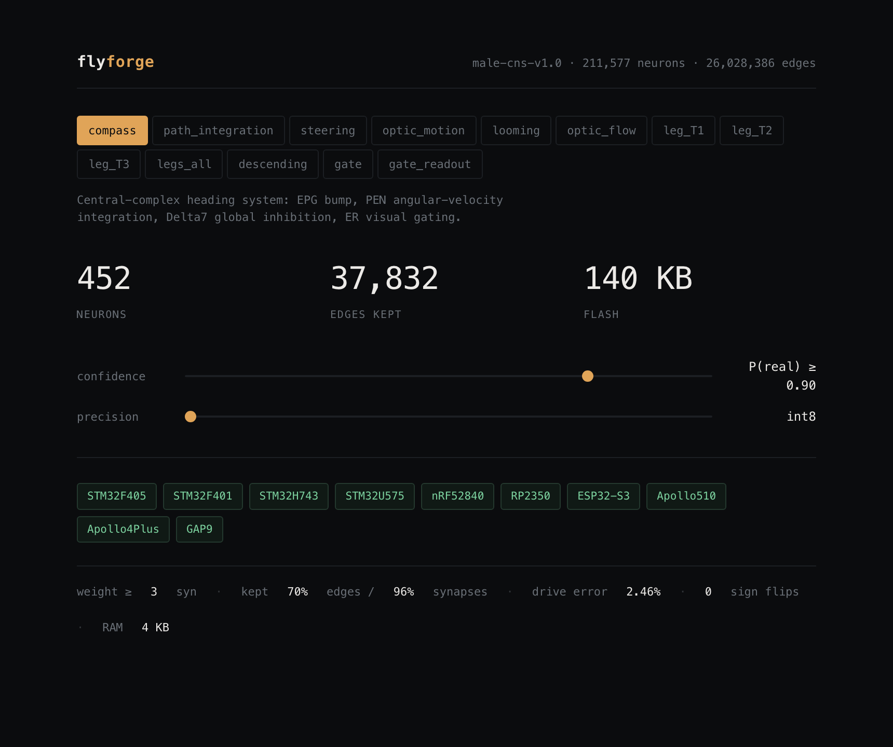
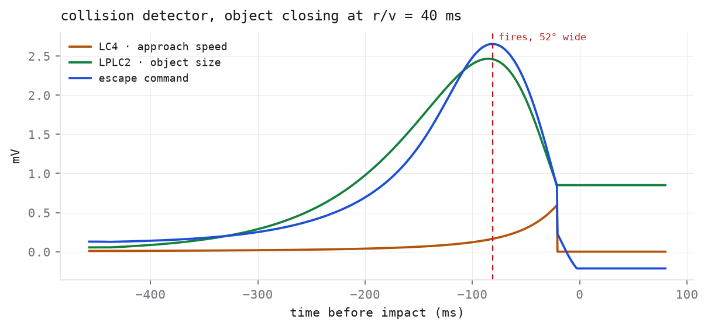
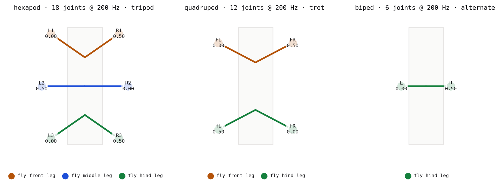
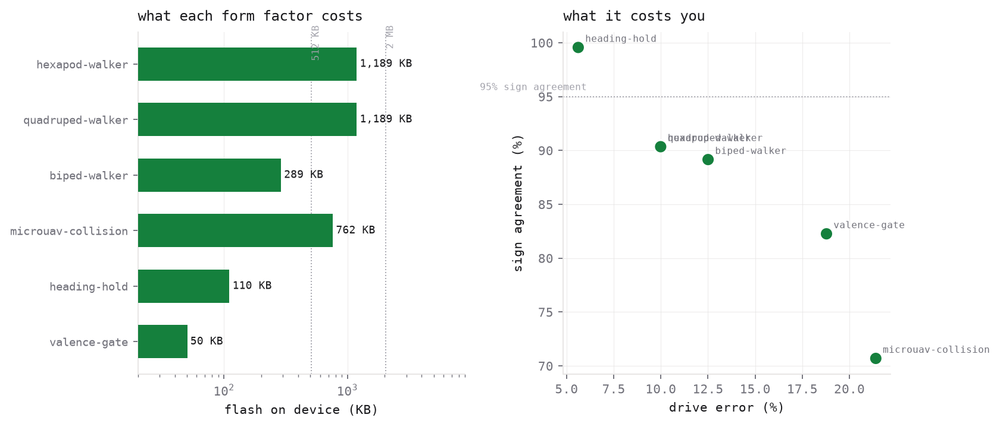

# Neural Transistor

**Control circuits for small robots, compiled from a fly brain. No training data.**



---

## The problem

Your robot needs to not hit things, or walk, or know which way it's pointing. The usual
answer is to train a network — which needs a dataset you don't have, a GPU you can't
carry, and weeks you'd rather not spend.

A fly does all three on about a milliwatt. The complete wiring diagram of its nervous
system was published and is free. Nobody had turned it into code you can flash.

This does. You get a `.c` file.

```bash
ntx quickstart              # downloads the data, builds, emits C. One command.
```

```
[6] emitting C into out/
  C emit: 452 neurons / 27,873 edges | flash 110.5 KB, ram 4.0 KB | w8 i16
    out/compass.h  out/compass.c  out/compass_runtime.c
[7] which chips it fits
  9 of 9: STM32F405, STM32F401, STM32H743, STM32U575, nRF52840, RP2350, ESP32-S3, ...
```

## What you can build

| circuit | does | flash | RAM | runs on |
|---|---|--:|--:|---|
| `looming` | **collision detector** — fires before impact | 762 KB | 66 KB | STM32F405 (the Crazyflie MCU) |
| `compass` | **heading estimator** — bearing with no GPS | 110 KB | 4 KB | anything, down to a 96 KB F401 |
| `legs_all` | **gait controller** — 6 legs, phase-locked | 1.2 MB | 104 KB | ESP32-S3 |
| `leg_T3` | **single-leg controller** | 289 KB | 28 KB | STM32H743 |
| `gate_readout` | **valence gate** — learned good/bad, multiplies downstream gain | 50 KB | 4 KB | everything |
| `descending` | **command bus** — all 1,314 brain→body lines | 239 KB | 12 KB | everything |

`ntx list` for the rest. Sizes are measured, at int8 with a stated confidence threshold.

## Does it actually work?

One circuit is proven, one is proven *not* to, and the honesty about which is the point.

**Collision detection works.** Driven by a camera, the compiled circuit fires **56 ms
before impact**, its onset scales with approach speed at **r = −0.9999**, and it triggers
at a constant object size (**19.9 ± 2.7°** across an 8× speed range). Linear speed scaling
plus a fixed size threshold are the two things that define a real collision detector, and
both fall out of the wiring with zero tuning.



**Heading doesn't work yet.** The compass forms a correct bearing estimate while it has
input and loses it the instant input stops — at *every* gain setting across a 250× sweep.
Wiring gives you structure, not memory. Fixing it needs the fitting stage
(`ntx` + `neuraltransistor.train`), which is built and running but has not closed it.

That difference is structural: collision detection is feed-forward, heading needs a
self-sustaining loop.

## Form factors



Motor outputs are labelled by the muscle they pull, and a muscle name gives you a joint
and a direction — so the mapping transfers to any robot. Point it at your URDF:

```bash
ntx emit legs_all -o out/ --target ros2 --urdf my_robot.urdf
# ros2 package: out/neuraltransistor_controller (12/12 joints driven @ 200.0Hz)
```

Each joint is driven by its own opposing pair, published as standard `JointState`.
Six worked builds ship in `neuraltransistor.recipe` — hexapod, quadruped, biped,
micro-UAV, heading-hold, valence-gate — with measured size, fidelity and board fit.



## API

```python
import neuraltransistor as nt

conn = nt.load()                          # the connectome, cached
ir   = nt.circuit(conn, "looming")        # 7,459 neurons

ir, stats = nt.prune(ir, p_real=0.95)     # drop connections that aren't real
ir, rep   = nt.quantize(ir, bits=8)       # int8 + delta-encoded index
nt.emit_c(ir, "out/")                     # freestanding C99, no malloc, no libc
```

Runs on GPU and is differentiable, so the dynamics can be trained:

```python
from neuraltransistor.train import RingAttractorTask, fit
fit(ir, task, steps=300)                  # 136 free parameters, not 54,290
```

## Two things worth knowing

**How much of a connectome is real?** The field keeps connections above an arbitrary
synapse count. We measured it instead: the left and right halves of the animal are
independent reconstructions of the same circuit, so agreement between them says whether
a connection is real — no ground truth needed. **One in five single-synapse connections
is noise, and they're 40% of the graph.** `--p-real 0.95` now means something.


**Compression is about addresses, not weights.** Two thirds of the bytes in a sparse
layer are indices. Dropping a connection removes its address too, so pruning is worth
~3× what dropping precision is. And the metric that matters isn't magnitude error, it's
whether signs survive — `compass` keeps 99.6% sign agreement where `looming` keeps 70.7%.

## Docs

| | |
|---|---|
| [FINDINGS.md](docs/FINDINGS.md) | what we measured, with the numbers |
| [TARGETS.md](docs/TARGETS.md) | every chip, real power figures, what has actually flown |
| [WHERE-THIS-FITS.md](docs/WHERE-THIS-FITS.md) | what was already published vs what this adds |
| [STATUS.md](docs/STATUS.md) | verified / code-exists / not built |
| [BIOLOGY.md](docs/BIOLOGY.md) | the neuroscience, kept out of the way |
| [DYNAMICS.md](docs/DYNAMICS.md) | what the wiring does *not* contain |
| [SENSORS.md](docs/SENSORS.md) | cameras, and the eye they have to imitate |

## Honest status

`pytest` 15/15 · `ntx eval` 20/20 · emitted C is **bit-identical to the reference for
64/64 ticks** on every circuit up to 34,038 neurons.

**Not done:** nothing has been flashed to a real board — every size fit is datasheet
arithmetic and no power number here is measured. Dynamics fitting is built but has not
yet made the compass hold a heading. The ROS 2 package has never run against a live ROS
install.
