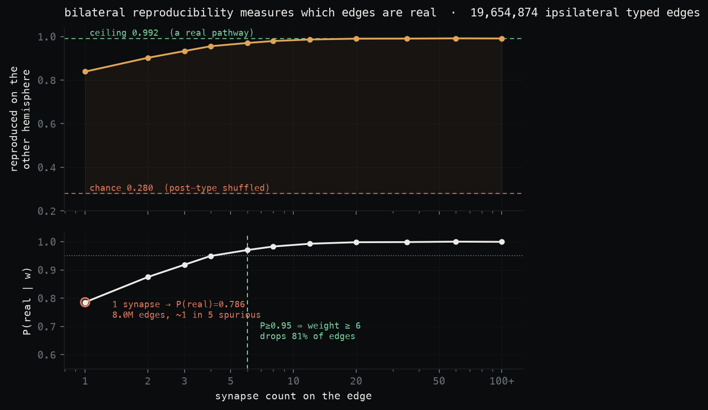
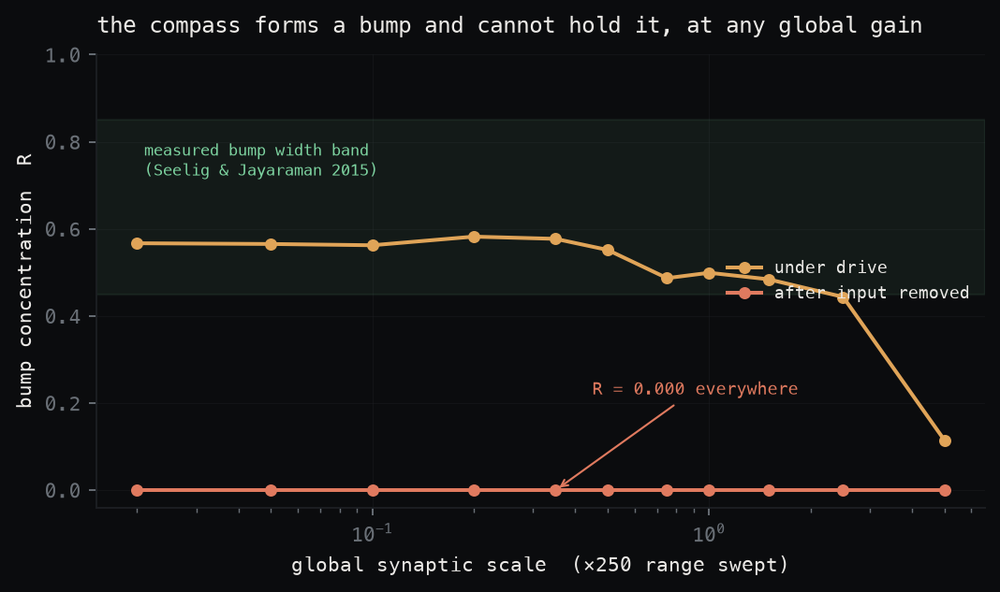
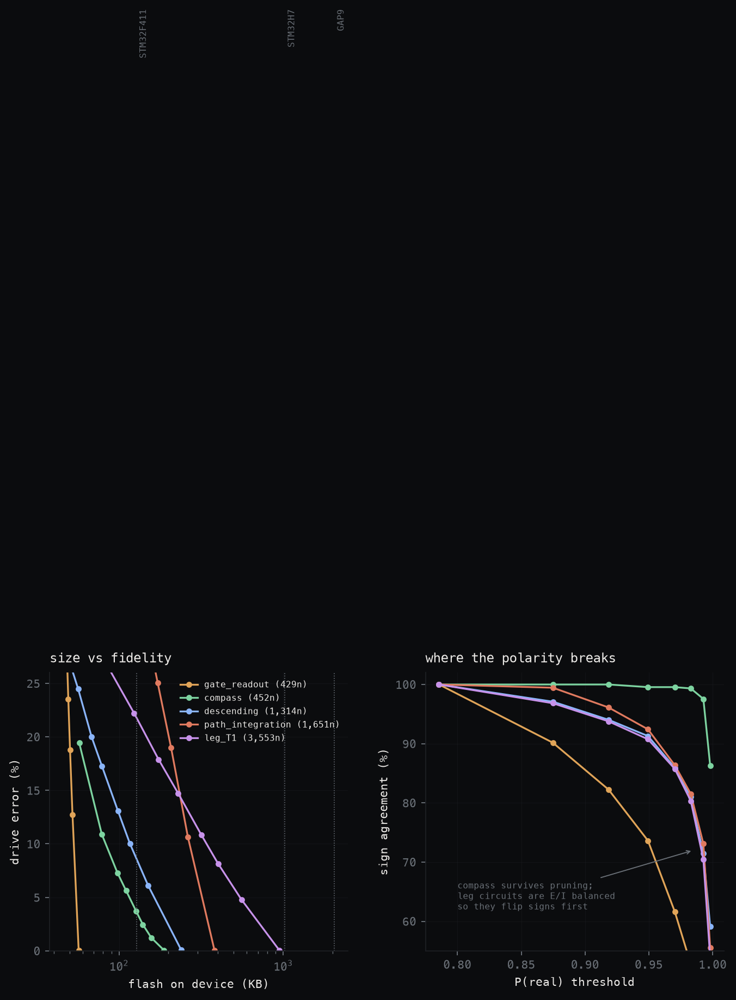
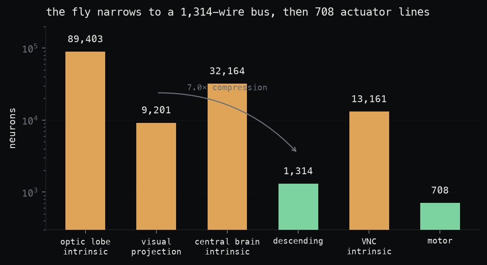

# Findings

Things this project measured that are worth knowing, with the numbers and the code.
Everything here was produced by running it on male-CNS v1.0, not quoted from a paper.

---

## 1. The fly is its own control experiment

Connectomics prunes weak edges by convention: keep connections of ≥5 synapses, or ≥10,
depending on the paper. The threshold is defensible and nobody reports what it costs,
because measuring that looks like it needs ground truth nobody has.

It doesn't. **The fly is bilaterally symmetric and the two hemispheres were
reconstructed independently.** They are a replicate pair. A real pathway should appear
on both sides; a reconstruction artifact has no reason to.

The design is unusually clean:

| | |
|---|--:|
| left neurons | 75,215 |
| right neurons | 75,119 |
| types present on both sides | 10,940 of 11,230 |
| median per-type L−R cell count difference | **0** |

Measured over 19,654,874 ipsilateral typed edges:



Reproducibility saturates at **0.992**, not 1.0 — some genuine connections are unilateral
and annotation is imperfect. A shuffled control (post-type permuted within hemisphere)
floors at **0.280**. So an observed rate is a mixture, and inverting it gives a per-edge
posterior:

```
P(real | w) = (observed(w) − 0.280) / (0.992 − 0.280)
```

| weight | edges | reproduced | P(real) |
|--:|--:|--:|--:|
| 1 | 7,994,902 | 83.9% | **0.786** |
| 2 | 3,718,546 | 90.2% | 0.875 |
| 3 | 2,042,085 | 93.3% | 0.918 |
| 4–5 | 2,166,674 | 95.5% | 0.949 |
| 6–7 | 1,117,581 | 97.0% | 0.970 |
| 8–11 | 1,097,106 | 97.9% | 0.983 |
| 12–19 | 802,046 | 98.6% | 0.993 |
| ≥20 | 715,934 | 99.0% | ~0.999 |

**About one in five single-synapse edges is spurious, and they are 40% of the compiled
graph.** A threshold becomes a stated confidence:

```bash
flyforge compress compass --p-real 0.95   # → weight ≥ 6, keeps 51% of edges, 90% of synapses
```

**Scope, stated plainly.** Reproducibility is measured at the level of a *type pair*, so
this is the probability the **pathway** is real — an upper bound on the probability that
one particular cell-to-cell edge is. That is the right quantity for deciding what to
compile, and the wrong one for a claim about an individual synapse. For calibration,
Schlegel et al. report roughly 42% cross-hemisphere recurrence for single-synapse
connections at the *cell* level; the gap between that and our 83.9% is exactly the
type-vs-cell distinction, not a contradiction.

Code: `flyforge/circuit/noise.py`, `flyforge noise`.

---

## 2. The three-line dict that silently reverses your robot

Everyone writes this:

```python
{"acetylcholine": +1, "glutamate": -1, "gaba": -1}
```

**Glutamate is inhibitory in the fly CNS but excitatory at the neuromuscular junction.**
Fly motor neurons are glutamatergic; glutamate onto muscle opens a cation channel and
contracts it. Apply the naive map and you invert the entire motor output layer — the
controller drives every actuator backwards, and nothing complains, because the graph is
still perfectly well-formed.

Measured on the 708 VNC motor neurons:

| | naive map | with the efferent exception |
|---|--:|--:|
| labelled inhibitory | **304** | **10** |

166 sign flips applied and reported. `flyforge/circuit/sign.py`; regression test in
`eval_nmj_guard` so it cannot be "simplified" back.

Sign coverage is also not uniform, and the place it is worst is the place it matters
most:

| circuit | signed | ground truth |
|---|--:|--:|
| central complex | 100.0% | 71.8% |
| optic motion | 99.0% | 70.4% |
| leg intrinsic | 99.2% | 83.0% |
| descending | 97.1% | 9.8% |
| **VNC motor** | **44.9%** | **0.0%** |

Unknown signs are not silently assumed excitatory. They are marked UNKNOWN and become
free parameters for the fitting stage.

---

## 3. The compass forms a bump and cannot hold it

EPG neurons tile a ring; correct behaviour is a single localized bump that persists
without input and rotates with angular velocity. The ring order is recoverable straight
from the data — `instance` strings carry the wedge index (`EPG(PB08)_L4`, `_R8`) — giving
**46 EPG neurons at 16 distinct ring positions**, matching the EB's 16 tiles.

So: drive one sector, release it, and measure the circular concentration
`R = |Σ r_j e^{iθ_j}| / Σ r_j`. R = 1 is a delta bump, R = 0 is uniform.



Swept across **250× of global synaptic gain**:

- a bump **does** form, at R up to **0.582** — inside the 0.45–0.85 band implied by the
  measured bump width (Seelig & Jayaraman 2015: FWHM 82.3 ± 11.5° with a stripe)
- it **never persists**. `R_held = 0.000` at every single scale
- nothing is silent, nothing saturates — this is not a dynamic-range failure
- past gain ≈0.2, more recurrence *smears* the bump rather than sustaining it

This independently reproduces, on a dataset nobody had run it on, three published
results: Chang et al. 2023 swept 176,400 parameter sets and found "all tested models
failed if we simply set the synaptic weights proportional to these numbers"; Duan et al.
2025 found one global gain gives no bump and two give a bump but no integration; Beiran
& Litwin-Kumar 2025 found connectome-constrained central-complex models "did not behave
as ring attractors."

**The wiring gives you spatial structure. It does not give you an attractor.** That is
the honest statement of what a connectome is worth, and it is why dynamics fitting is a
milestone rather than a footnote. See [DYNAMICS.md](DYNAMICS.md).

Code: `flyforge/evals/functional.py`.

---

## 4. The index dominates, not the weights

Two facts decide how compression should work.

**The weights are already nearly low-precision.** In the raw release, 62.0% of edges are
a single synapse and 99.03% are ≤15. Over the retained annotated graph it is 40.4% and
94.3%, with 98.1% ≤31 — dropping fragments removes weak edges preferentially, so the
graph you actually compile wants about one more bit than the raw distribution suggests.

**The index costs more than the weight.** A sparse layer at int8 weights with int16
indices spends two thirds of its bytes on addressing. Going 8→4 bits shrinks the artifact
by 17%, not 50%. Dropping an edge removes its index too, so **pruning is worth roughly 3×
what requantizing is** — which is why the budget solver prunes first and requantizes
second.

Indices within a CSR row are sorted, so delta-encoding them often fits 8 bits and halves
the index cost outright. Compass: 188 KB → 73.6 KB at **0.000%** drive error.



The right panel is the part people get wrong. Magnitude error is not the metric that
matters — **sign agreement** is. The compass keeps 99.56% sign agreement at weight ≥6;
`leg_T1` drops to 85.7% at the same threshold, because leg circuits are far more E/I
balanced and their signed sums cross zero sooner.

### A metric bug worth repeating

The obvious error metric — `|d1 − d0| / |d0|` on the signed input sum — is unstable, and
it *exaggerates* damage. A neuron whose excitation and inhibition nearly cancel has |d0|
near zero, so its relative error explodes regardless of how little changed. On compass,
13.7% of neurons sit at |signed| / |total| < 0.15, and 14 of 451 show >100% "error" while
their median signed/total ratio is 0.080 against 0.728 for everyone else.

Normalising by **total** input magnitude instead: pruning to weight ≥6 reads as **5.6%**,
not 20.5%, with r = 0.994 and 99.6% sign agreement. The signed normalisation overstated
the damage fourfold. `flyforge/quant/quantize.py` reports the stable one, and keeps the
unstable one alongside for comparison.

---

## 5. The gate is multiplicative, and you can prove it

The mushroom body is small enough to be surprising:

| | neurons | |
|---|--:|---|
| MBON | **97** | the entire learned-valence readout |
| DAN (PAM/PPL1) | 354 | the dopaminergic gate |
| KC | 4,064 | sparse context code |
| **APL** | **2** | global inhibition, one per hemisphere |

Dopaminergic terminals *scale* their target's gain; they do not inject current. Compile
them as ordinary additive synapses and you get a well-formed graph with the gating
silently removed. The only way to know which you built is to silence the pathway and see
whether anything moves:

| circuit | neurons that shift | mean rate change |
|---|--:|--:|
| `gate` | 3,524 | **27.3%** |
| `compass` | 229 | 16.3% |
| `descending` | 323 | 4.7% |
| `legs_all` | 1,011 | 1.0% |

Asserted in `eval_gating_changes_behaviour`, so a refactor that flattens modulatory edges
into the chemical list fails the suite instead of quietly shipping.

---

## 6. Motor neurons are named by muscle

This is what makes morphology retargeting principled instead of hand-waved. The release
annotates motor neurons with the muscle they innervate — `Ti extensor MN`,
`Tergopleural/Pleural promotor MN`, `Ta levator MN` — and a muscle name states a joint
and a direction, both of which transfer to any articulated robot.

```
coxa_yaw     ThC    promotor / remotor          hip yaw
coxa_roll    ThC    abductor / adductor         hip roll
trochanter   CTr    Tr extensor / Tr flexor     hip pitch
knee         FTi    Ti extensor / Ti flexor     knee
ankle        TiTa   Ta levator / Ta depressor   ankle
```

34 decodes fall out of `legs_all`: 3 leg pairs × 5 joints, plus 4 wing channels
(subclass `wm`, split power vs steering). 100% joint coverage on hexapod, quadruped and
biped at 3 DOF.

The antagonist ratios are biologically right, which is a decent sanity check on the
whole pipeline: the knee has **2 extensor against 15 flexor** motor neurons, matching
the known asymmetry in fly leg motor pools.


